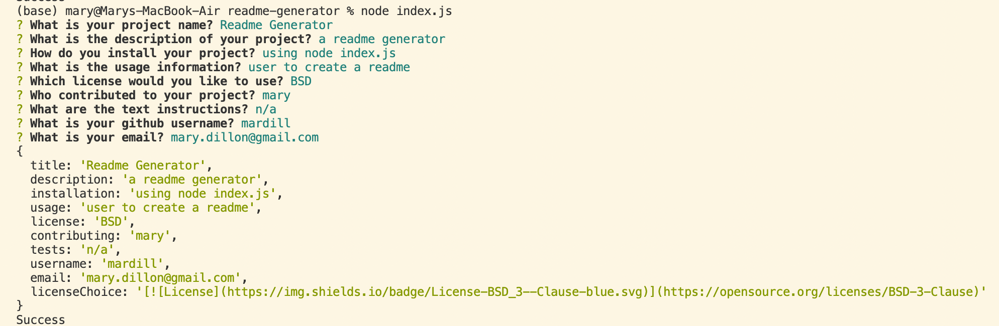

# Professional Readme Generator

    
## Description

This application creates a professional readme generator based on prompts. It is easy to use to make the process of writing a readme quick with stylized headings and links to the creators contact information and github url. the prompts can be tweaked by the user using the prompt code and additional information can be added.

Example output:

## Table of Contents

* [Installation](#installation)
* [Usage](#usage)
* [Credits](#credits)
* [License](#license)
* [Contributing](#contributing)
* [Tests](#tests)
* [Questions](#questions)

## Installation

clone the applicaiton from github and in your local computer run 'node index.js'

## Usage

With this application, a user is able to generate a preformatted readme file from a series of prompts. The user simply types their answer to the prompt and the asnswer is appended to the correspponding section of the readme file that is outputted from this code. 

## Credits

Mary Dillon

## License

This is covered under the MIT license. 

## Contributing

Mary Dillon

## Tests

n/a

## Questions

### Github Username
mardill: [https://github.com/mardill](https://github.com/mardill)

### Email
mary.dillon09@gmail.com

     
